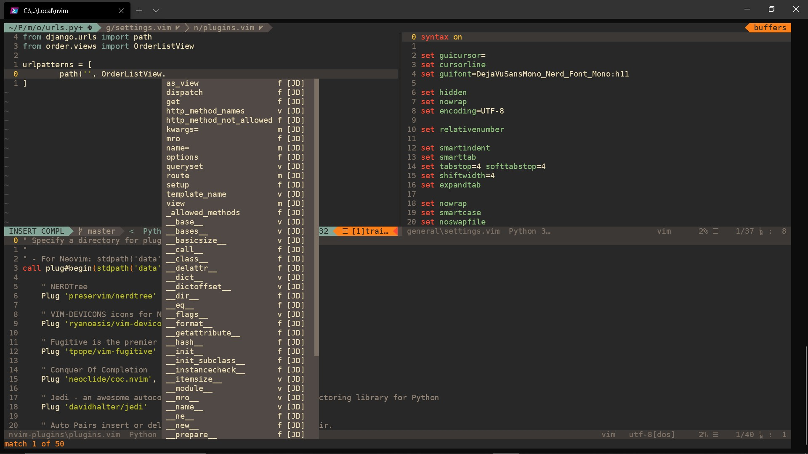

# NeoVim Config Files.

                     __                         _   __      _
                    / /___  _________ ____     / | / /   __(_)___ ___
               __  / / __ \/ ___/ __ `/ _ \   /  |/ / | / / / __ `__ \
              / /_/ / /_/ / /  / /_/ /  __/  / /|  /| |/ / / / / / / /
              \____/\____/_/   \__, /\___/  /_/ |_/ |___/_/_/ /_/ /_/
                              /____/



## Introducción

Utilizo NeoVim principalmente para desarrollo "fullstack", esta configuración está optimizada para trabajar con Python, HTML, CSS y JavaScript.

## Instalación

1. Obviamente primero debes tener instalado [git](https://git-scm.com/downloads)

2. [NeoVim](https://github.com/neovim/neovim/wiki/Installing-Neovim) en tu sistema, asegurate de tener la versión más reciente.

###### Ubuntu, Debian, etc.

```sh
sudo apt install neovim python-neovim python3-neovim python3-jedi python-pipenv xsel xclip
```

###### Archlinux, Manjaro, etc.

```sh
sudo pacman -S neovim python-pynvim python-jedi python-pylint python-pipenv xsel xclip
```

Despues instala los siguentes paquetes y plugin manager.

### Dependencias y Plugins

Los siguientes paquetes son requeridos para la instalación de los plugins y las extensiones.

1. 📦 Node.js https://nodejs.org/en/download/package-manager/

   En Ubunut y otras distribuciones basadas en Debian:

   ```sh
   sudo apt install npm
   ```

   En Manjaro y otras distribuciones basadas en Arch:

   ```sh
   sudo pacman -S npm
   ```

   En Windows puedes bajarlo directamente desde nodejs.org o utlizando Chocolatey (Mi recomendación), más información en: https://nodejs.org/en/download/package-manager/#windows

2. 📦 "vim-plug" https://github.com/junegunn/vim-plug

   Atención aquí, este plugin tiene distintas instrucciones si utilizas VIM, asegurate de seguir las instrucciones para NeoVim como sigue:

   #### Neovim

   ###### Unix, Linux

   ```sh
   sh -c 'curl -fLo "${XDG_DATA_HOME:-$HOME/.local/share}"/nvim/site/autoload/plug.vim --create-dirs \
       https://raw.githubusercontent.com/junegunn/vim-plug/master/plug.vim'
   ```

   ###### Linux (Flatpak)

   ```sh
   curl -fLo ~/.var/app/io.neovim.nvim/data/nvim/site/autoload/plug.vim \
       https://raw.githubusercontent.com/junegunn/vim-plug/master/plug.vim
   ```

   ###### Windows (PowerShell)

   ```powershell
   md ~\AppData\Local\nvim-data\site\autoload
   $uri = 'https://raw.githubusercontent.com/junegunn/vim-plug/master/plug.vim'
   (New-Object Net.WebClient).DownloadFile(
   $uri,
   $ExecutionContext.SessionState.Path.GetUnresolvedProviderPathFromPSPath(
       "~\AppData\Local\nvim-data\site\autoload\plug.vim"
   )
   )
   ```

3. 📦 Nerd Font: https://www.nerdfonts.com/font-downloads

   Este tipo de letra es la que te va a permitir visualizar iconos en tu terminal, puedes utilizar cualquiera de las "Nerd Fonts", el tipo de letra que se ve en la imágen del proyecto es "DejaVuSansMono Nerd Font"

   Una vez que la hayas descargado, descomprimela.

   Para Instalarla:

   ###### Linux

   Copia los archivos a `~/.local/share/fonts`

   Si la carpeta no existe, la puedes crear utilizando `mkdir ~/.local/share/fonts`

   Luego actualiza el cache con el comando `fc-cache -fv`

   ###### Windows

   Selecciona todos los archivos que acabs de descomprimir (.ttf), clic derecho y presiona "instalar"

### Clona el projecto en tu sistema

Para clonar el proyecto:

###### Linux

```sh
git clone https://github.com/jorge-ramirezs/nvim.git ~/.config/nvim
```

###### Windows

```powershell
git clone https://github.com/jorge-ramirezs/nvim.git ~\AppData\Local\nvim
```

### Instala los Plugins en NeoVim

Una vez clonado el proyecto, abre NeoVim, al principio recibiras unos errores porque requieres instalar los Plugins con el siguiente comando:

```
:PlugInstall
```

## Detalles

#### Plugins

```
    " NERDTree
    Plug 'preservim/nerdtree'

    " VIM-DEVICONS icons for NERDTree
    Plug 'ryanoasis/vim-devicons'

    " Fugitive is the premier Vim plugin for Git.
    Plug 'tpope/vim-fugitive'

    " Conquer Of Completion
    Plug 'neoclide/coc.nvim', {'branch': 'release'}

    " Jedi - an awesome autocompletion, static analysis and refactoring library for Python
    Plug 'davidhalter/jedi'

    " Auto Pairs insert or delete brackets, parens, quotes in pair.
    Plug 'jiangmiao/auto-pairs'

    " Airline status bar
    Plug 'vim-airline/vim-airline'
    Plug 'vim-airline/vim-airline-themes'

    " Other themes
    Plug 'gruvbox-community/gruvbox'
    Plug 'sainnhe/gruvbox-material'
    Plug 'phanviet/vim-monokai-pro'
    Plug 'flazz/vim-colorschemes'

    " Vim Prettier
    Plug 'prettier/vim-prettier', { 'do': 'npm install'  }

    " NERDCommenter
    Plug 'preservim/nerdcommenter'
```

#### Key Mappings

```
" Mapping NERDTree
map <C-n> :NERDTreeToggle<cr>

" Use alt + hjkl to resize windows
nnoremap <M-j>  :resize -2<CR>
nnoremap <M-k>  :resize +2<CR>
nnoremap <M-h>  :vertical resize -2<CR>
nnoremap <M-l>  :vertical resize +2<CR>


" NerdCommenter Toggle remap to CTRL+/
vmap <C-_> <Plug>NERDCommenterToggle<cr>
nmap <C-_> <Plug>NERDCommenterToggle<cr>

" Start Terminal using PowerShell 7 (Preview)
" For default shell, remove "://pwsh.exe"
" You can customize the shell by replacing "pwsh.exe" with your shell for example:
"       :edit term://bash
"       :vsplit term://top
" For more :help terminal
nmap <leader>t :vsplit term://pwsh.exe<cr>
```

#### Temas y demás colores

1. Terminal:

   - La terminal que utilizo es [Alacritty](https://github.com/alacritty/alacritty#configuration)
   - También puedes utilizar [Windows Terminal](https://docs.microsoft.com/en-us/windows/terminal/) si así lo prefires.

2. Command Promt:
   ###### Windows
   - Utilizo "PowerLine" como "tema" en mi línea de commandos (Command Prompt)
     - Las instrucciones para instalar PowerLine se encuentran en https://docs.microsoft.com/en-us/windows/terminal/tutorials/powerline-setup
   ###### Linux
   - En Linux estoy utilizando zsh como shell
   - El tema (colores y estilo) de mi linea de comandos es [Powerlevel10k](https://github.com/romkatv/powerlevel10k)
